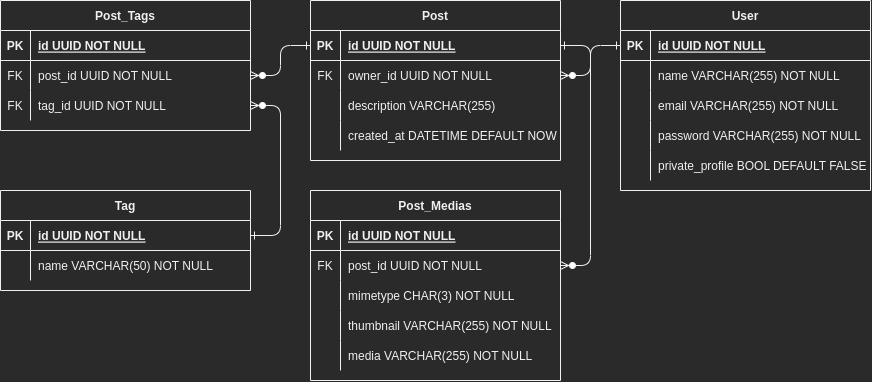
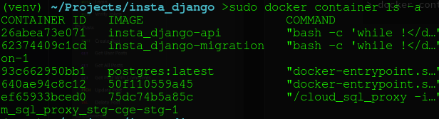
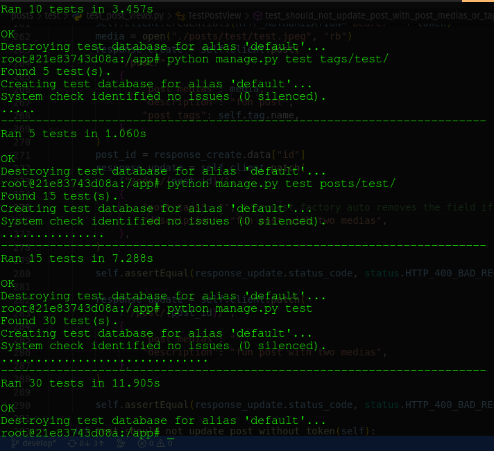

# Insta Django

An API to serve a social network developed in django aiming improve skills and knowledges about the framework and tools about image manipulation in python. 

This API has features such as: 
<ul>
<h4>Users:</h4>
  <li>Register</li>
  <li>Authentication with JWT</li>
  <li>Update, List and Delete own profile</li>
  <li>List other users with optional filter by name</li>
</ul>
<ul>
<h4>Posts:</h4>
  <li>Create new post associating with existing tags and sending images</li>
  <li>Update and Delete posts by id (must be owner)</li>
  <li>List posts with optional filters such as by mimetype, tag name and upload date range</li>
</ul>
<ul>
<h4>Tags:</h4>
  <li>Create tags</li>
  <li>List tags with optional filter by name</li>
</ul>

For more details about the routes see the documentation and it is highly recommended to also see the Insomnia Collection, which contains more details about the request and response bodies with the possibility to test the routes. Insomnia Collection link below will lead you to raw of the original insomnia_collection.json file, you can just copy the content and paste in Insomnia import collection section or download the file and load it in Insomnia.

[Redoc Documentation](ec2-15-228-242-73.sa-east-1.compute.amazonaws.com/api/docs/) 

Insomnia Collection -> [insomnia_collection.json](./insomnia_collection.json)

Technologies:

- Python/Django
- Rest Framework
- Redoc (drf-spectacular)
- DRF Simple JWT
- django-filter
- Docker & Docker Compose
- Postgres (psycopg2)
- MoviePy
- OpenCV
- numpy

### ERD (Entity Relationship Diagram):



### Running and Testing the API:

First, you’ll need Docker and Git properly installed and configured in your machine.

With Git properly configured you can use `git clone` in your terminal to download the project:

```bash
> git clone git@github.com:2victor2/insta_django.git
```

After cloning, you’ll need to create a configuration file named .env. There’s an example of this file named .env.example in root folder of the project.

Now you can execute docker compose in your terminal:

```bash
> docker compose up --build
```

If any error mentioning permission denied shows up means that your user is not part of the docker group and cannot execute docker without root permission, see docs to more details -> [Docker post-install](https://docs.docker.com/engine/install/linux-postinstall/). However, in linux you can ignore this using `sudo` before the command.

To test the API you’ll need execute a new terminal with our compose running, so open a new terminal and execute the following commands:

```bash
> docker container ls
```



Here the `-a` option makes this command list also sleeping containers, but what matters is the container id (first column) of the container with the image (second column) corresponding to our `insta_django-api`. With container id you can execute:

```
> docker exec -it <container id> /bin/bash
```

Now in bash of the container you can execute `python manage.py test` to run all the 31 integration tests, but if you want a more accurate approach you can execute `python manage.py test appFolder/`. 




                                               made with ❤️ by 2victor2
